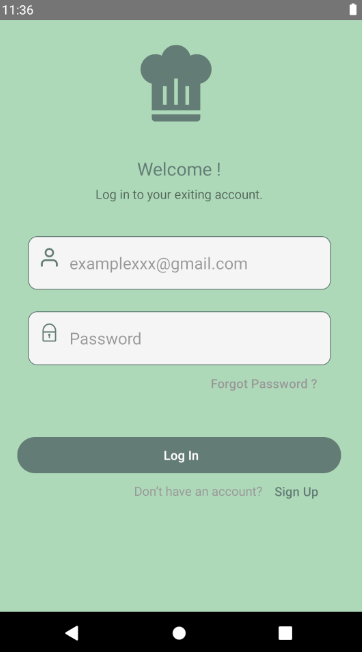
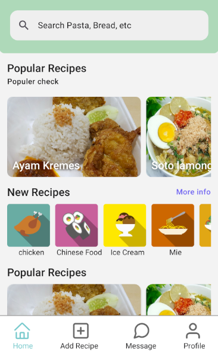
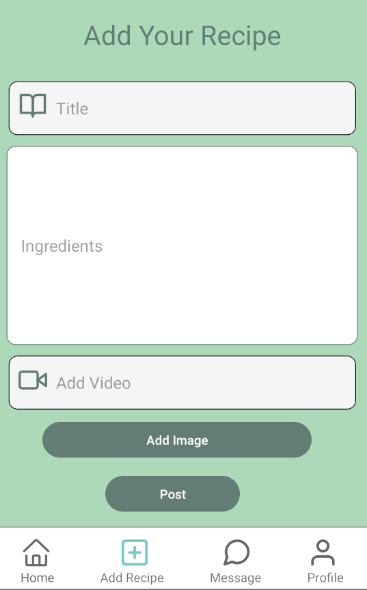
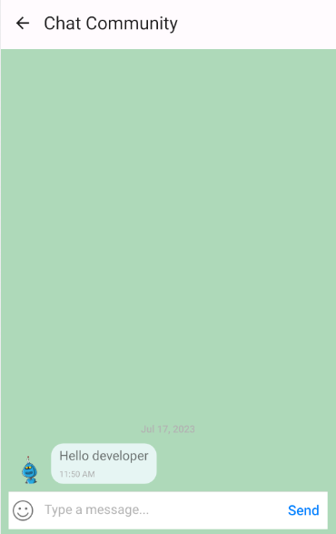

<br>

# Aplikasi Pijar Food FE
The Pijar Food FE application is a tutorial application for creating various types of food, combined with video tutorials and written ingredients. This application utilizes the PostgreSQL database, Express JS for backend development, and utilizes the React Native library, React Native Navigation, and React Native Icons for frontend development.

## Instal
The Food Recipe website can run on your local machine. Please download this repository and open it using Visual Studio Code. Then, run the terminal with the following commands.
```sh
cd pijar-food-rn-fe
npm i
npm run start
```

## Fitures Aplikasi Pijar Food FE
- Tutorials for various recipes
- Equipped with video tutorials
- Add recipe page
- Recipe page
- Send messages between users

## Tech
- [HTML] - Hypertext Markup Language (HTML) is the standard markup language for creating and structuring web pages and applications.
- [CSS] - Cascading Style Sheets (CSS) is used to control the appearance of elements written in the markup language.
- [JavaScript] - Programming languages used in website development to make them more dynamic and interactive.
- [React JS](https://legacy.reactjs.org/) -  JavaScript library used in the development process of dynamic web applications.
- [React Native](https://reactnative.dev/) - The framework used to create mobile apps on both Android and iOS operating systems simultaneously.
- [React Native Icon](https://oblador.github.io/react-native-vector-icons/) 
- [React Native Navigation](https://reactnavigation.org/) - A popular library for managing navigation in React Native applications. 
- [React Native Paper](https://reactnativepaper.com/) - An open-source library that provides ready-to-use Material UI design components for React Native applications.
## Screenshots
<table>
 <tr>
    <td></td>
  </tr>
  <tr>
    <td>Login</td>
  </tr>
 <tr>
  <td></td>
 </tr>
  <tr>
    <td>Register</td>
  </tr>
 <tr>
  <td> </td>
 </tr>
  <tr>
   <td>Home</td>
  </tr>
  <tr>
    <td> </td>
  </tr>
   <tr>
    <td>Add Recipe</td>
  </tr>
   <tr>
    <td> </td>
  </tr>
   <tr>
    <td>message</td>
  </tr>
 <tr>
   <td> </td>
 </tr>
 <tr>
     <td>Profile</td>
  </tr>
</table>

## Related Project

- [`Frontend Recipe Food`](https://github.com/MuhammadSonySetiawan/pijar-food-rn-fe)

- [`Backend Recipe Food`](https://github.com/MuhammadSonySetiawan/pijar_food_be_rn)

- [`Demo Recipe Food`](https://github.com/MuhammadSonySetiawan/pijar-food-rn-fe/releases/tag/1.0.0)
