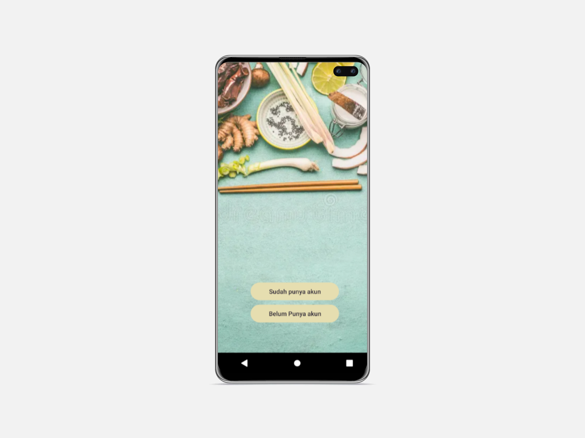
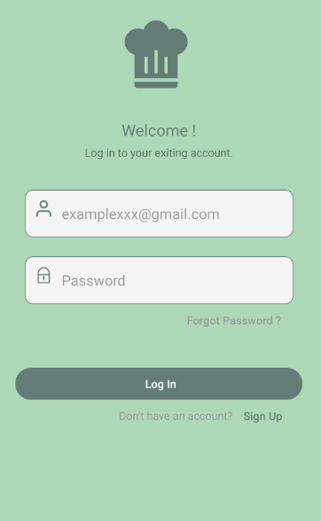

<br>

# Aplikasi Pijar Food FE
Aplikasi Pijar food FE adalah aplikasi tutorial pembuatan berbagai macam makanan di padu dengan video tutorial dan bahan-bahan yang telah ditulis. Aplikasi ini menggunakan database postgresQL, Express JS untuk pembuatan backend dan menggunakan library React Native, React Native Navigation dan React Native Icons untuk pembuatannya frontend.

## Instal
Situs Resep Makanan dapat berjalan di lokal Anda, unduh repo ini dan buka menggunakan kode studio visual, dan jalankan terminal seperti di bawah ini.
```sh
cd pijar-food-re-fe
npm i
npm run start
```

## Fitures Aplikasi Pijar Food FE
- Tutorial berbagai masakan
- Di bekali juga dengan video turtorial
- halaman tambah resep
- halaman resep
- kirim pesan antar pengguna

## Tech
- [HTML] - Hypertext Markup Language, yaitu bahasa markup standar untuk membuat dan menyusun halaman dan aplikasi web
- [CSS] - Cascading Style Sheet yaitu digunakan untuk mengatur tampilan elemen yang tertulis dalam bahasa markup
- [JavaScript] - pemrograman yang digunakan dalam pengembangan website agar lebih dinamis dan interaktif
- [React JS](https://legacy.reactjs.org/) -  library JavaScript yang digunakan dalam proses pengembangan aplikasi web dinamis.
- [React Native](https://reactnative.dev/) - framework yang digunakan untuk membuat mobile app di dua sistem operasi sekaligus, yaitu Android dan iOS.
- [React Native Icon](https://oblador.github.io/react-native-vector-icons/) 
- [React Native Navigation](https://reactnavigation.org/) - perpustakaan populer untuk mengatur navigasi dalam aplikasi React Native. 
- [React Native Paper](https://reactnativepaper.com/) - library open-source yang menyediakan komponen desain Material UI yang siap pakai untuk aplikasi React Native.
## Screenshots
<table>
 <tr>
    <td></td>
  </tr>
  <tr>
    <td>Login</td>
  </tr>
 <tr>
  <td></td>
 </tr>
  <tr>
    <td>Register</td>
  </tr>
 <tr>
  <td> </td>
 </tr>
  <tr>
   <td>Home</td>
  </tr>
  <tr>
    <td> </td>
  </tr>
   <tr>
    <td>Add Recipe</td>
  </tr>
 <tr>
   <td> </td>
 </tr>
 <tr>
     <td>Profile</td>
  </tr>
</table>

## Related Project

- [`Frontend Recipe Food`](https://github.com/MuhammadSonySetiawan/pijar-food-rn-fe)

- [`Backend Recipe Food`](https://github.com/)

- [`Demo Recipe Food`]()
